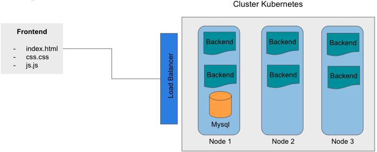

# Projeto Deploy Kubernetes

****Criando um deploy de uma aplicação****

## ****Descrição****

No desenvolvimento do projeto serão criadas as imagens dos contêineres e serviços necessários no Kubernetes para que a aplicação esteja pronta para produção.

### ****Arquitetura do cluster e aplicação****

## ****Banco de dados****

| id | int |
| --- | --- |
| nome | varchar |
| email | varchar |
| comentario | varchar |
